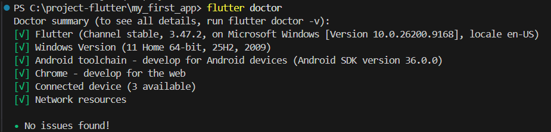
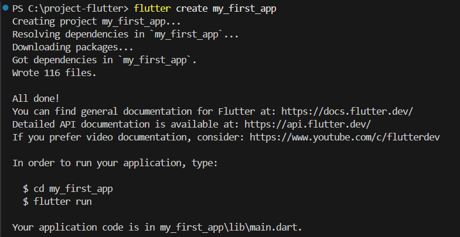
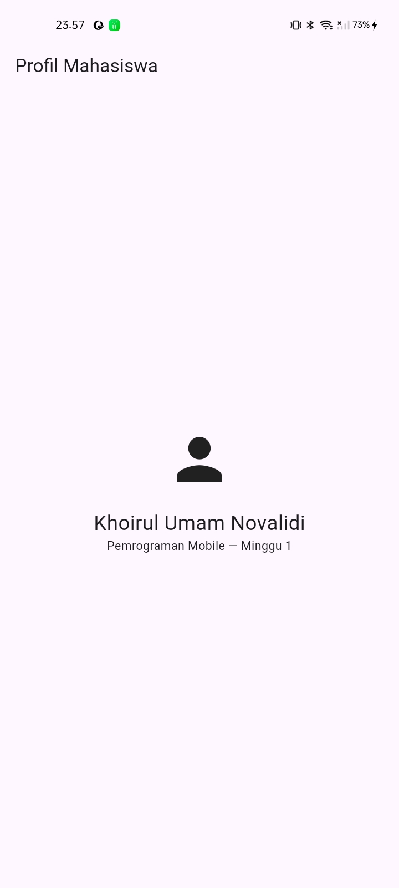
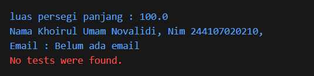
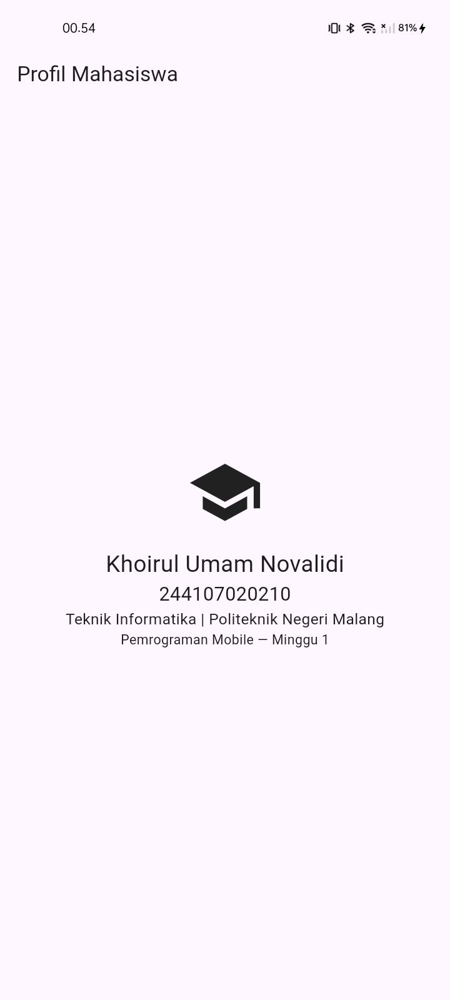

# Laporan Praktikum Minggu 1: Mobile Development Ecosystem & Flutter Refresh

**Nama:** Khoirul Umam Novalidi<br>
**NIM:** 244107020210  
**Kelas:** TI-3C

Berikut adalah hasil pengerjaan praktikum minggu pertama untuk pengenalan dasar Flutter.

## 1. Instalasi dan Setup Flutter

Tahap awal melakukan pengecekan flutter doctor, dan outputnya seperti gambar dibawah ini:

**Pengecekan Flutter Doctor**


Setelah selesai melakukan pengecekan flutter doctor, saya membuat project flutter pertama saya, dan outputnya seperti gambar dibawah ini:

**Project Flutter Pertama**



Tampilan awal run project

**Tampilan Awal**




## Perbedaan Hot Reload dan Hot Restart

Setelah mencoba membuat perubahan pada project flutter, saya memahami perbedaan hot reload dan hot restart, yaitu:

   - Hot Reload : Fungsi ini digunakan untuk memperbarui tampilan aplikasi dengan cepat tanpa kehilangan status atau data yang sedang berjalan di aplikasi.

   - Hot Restart : Fungsi ini digunakan ketika membuat perubahan yang dapat mempengaruhi state (status) aplikasi secara keseluruhan.


## 2. Latihan Mandiri

Pada latihan kali ini saya membuat fungsi `hitungLuasPersegiPanjang` dan class `Profile` dengan atribut `nama`, `nim`, dan `email` yang boleh dikosongkan pada file `test/widget_test.dart`, berikut syntax kodenya: 

```dart
void main() {
  double luas = hitungLuasPersegiPanjang(10, 10);
  print('luas persegi panjang : $luas');

  Profil profil1 = Profil(nama: 'Khoirul Umam Novalidi', nim: '244107020210');
  String emailDitampilkan = profil1.email ?? 'Belum ada email';
  print(
    'Nama ${profil1.nama}, Nim ${profil1.nim}, \nEmail : $emailDitampilkan',
  );
}

double hitungLuasPersegiPanjang(double panjang, double lebar) {
  return panjang * lebar;
}

class Profil {
  Profil({required this.nama, required this.nim, this.email});
  final String nama;
  final String nim;
  final String? email;
}
```

dan berikut hasil runningnya

**Hasil Running**




## 3. Kendala saat Setup

Saya menemukan kendala saat instalasi Android Studio, lama instalasinya karena ukuran dari aplikasinya lumayan besar, dan juga terdapat kendala saat mau running project ke devices android yang tersambung, tetapi setelah saya mencari solusi, saya mendapatkan solusinya dan running project ditampilkan ke device android telah berhasil.


## 4. Mini Assignment

Pada Jobsheet kali ini, perintahnya adalah menambahkan NIM dan satu informasi tambahan menggunakan widget dasar, berikut kode yang saya tambahkan pada `lib/main.dart`:


**Kode yang saya tambahkan**
```dart
Icon(Icons.school, size: 72),
SizedBox(height: 16),
Text('Khoirul Umam Novalidi', style: TextStyle(fontSize: 24)),
Text('244107020210', style: TextStyle(fontSize: 20)),
Text(
  'Teknik Informatika | Politeknik Negeri Malang',
  style: TextStyle(fontSize: 16),
),
Text('Pemrograman Mobile — Minggu 1'),
```


**Tampilan setelah ditambahkan kode diatas**




## 5. Refleksi

1. **Kapan native lebih tepat dipilih daripada cross-platform?**

   - Pengembangan aplikasi secara native lebih cocok digunakan jika aplikasi membutuhkan performa yang tinggi. Native juga membuat aplikasi bisa mengakses perangkat keras secara lebih langsung, seperti RAM, GPU, dan sensor tertentu.

2. **Bagaimana perubahan state berhubungan dengan widget tree dan UI deklaratif?**

    - Perubahan state akan membuat Flutter memperbarui widget tree. Saat state berubah, build() akan dijalankan lagi untuk membuat widget tree yang baru. Setelah itu, Flutter akan membandingkannya dengan yang lama dan memperbarui bagian UI yang berubah.

3. **Mengapa commit kecil dengan pesan jelas bermanfaat bagi pekerjaan tim dan portfolio?**

    - Commit kecil dengan pesan jelas sangat bermanfaat bagi pekerjaan tim dan portofolio karena memudahkan untuk dipahami oleh anggota tim, dan juga memudahkan anggota tim untuk mencari/melacak jika ada kesalahan (error) pada project, sehingga lebih mudah untuk memperbaiki kesalahan.