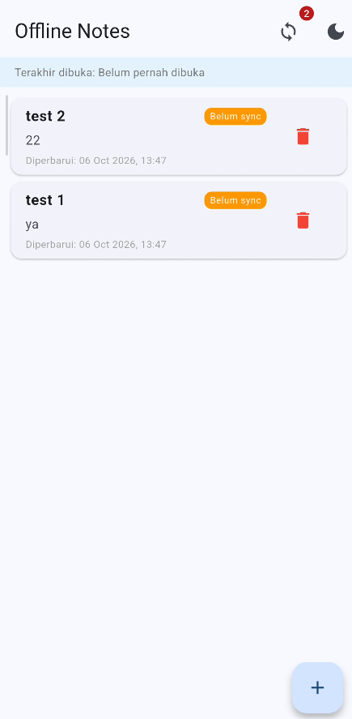
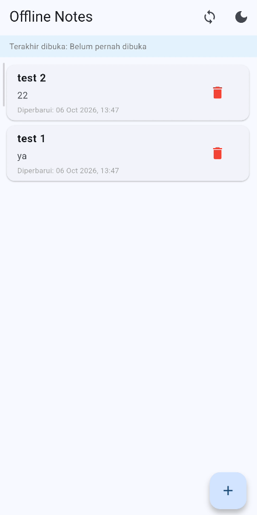
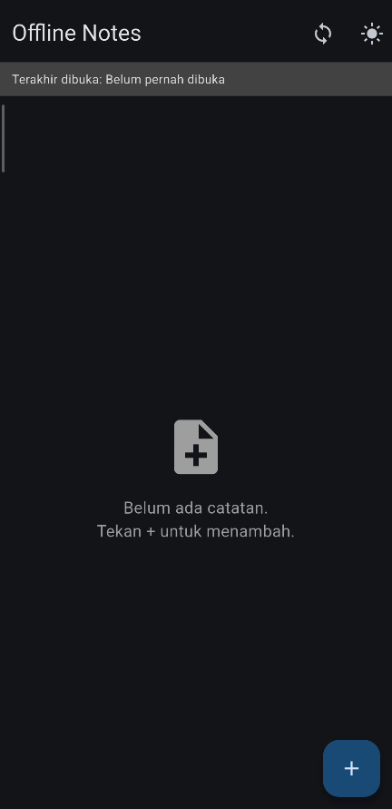
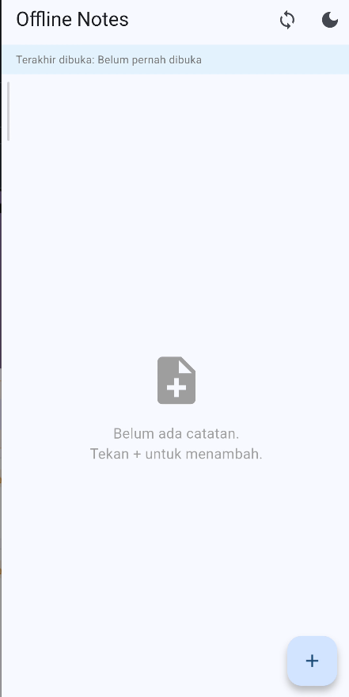

# Dokumentasi Bukti Mode Pesawat (Offline-First)

Dokumen ini berisi bukti pengujian fitur **Offline-First** pada aplikasi Offline Notes sesuai dengan ketentuan tugas poin 4:
> **4. Bukti mode pesawat**: screenshot daftar catatan saat offline dan badge dirty sebelum/sesudah sync.

---

## 1. Mekanisme Kerja Offline-First & Dirty Flag

Aplikasi Offline Notes menerapkan arsitektur **Offline-First** dengan alur kerja berikut:

1. **Penyimpanan Lokal Utama (SQLite / Cache-First)**:
   - Setiap operasi penambahan (Create) atau pengubahan (Update) catatan disimpan langsung ke database lokal SQLite.
   - Kolom `is_dirty` diatur ke nilai `1` (`true`) sebagai penanda bahwa catatan belum disinkronkan ke server remote.
   - Aplikasi dapat beroperasi penuh tanpa koneksi internet (mode pesawat aktif).

2. **Indikator Visual (Badge Dirty)**:
   - Catatan yang baru dibuat/diubah memiliki badge berwarna oranye dengan label **"Belum sync"**.
   - Pada AppBar, ikon sinkronisasi menampilkan badge angka berwarna merah yang menunjukkan total catatan yang belum di-sync (`dirtyCount`).

3. **Sinkronisasi (Sync Notes)**:
   - Saat pengguna menekan ikon sinkronisasi (`syncNotes`), aplikasi akan mengambil semua catatan bertanda dirty.
   - Catatan diunggah ke repositori remote (`FakeRemoteRepository`) menggunakan aturan resolusi konflik **Last Write Wins (LWW)**.
   - Setelah sukses diunggah, status `is_dirty` di database lokal diubah menjadi `0` (`false`).
   - Badge "Belum sync" dan indikator counter otomatis hilang dari tampilan UI.

---

## 2. Bukti Pengujian Mode Pesawat

### A. Sebelum Sinkronisasi (Offline / Dirty State)

Pada kondisi offline (misalnya saat mode pesawat aktif atau jaringan terputus), pengguna menambahkan dua catatan: `test 1` dan `test 2`. Keduanya tersimpan di SQLite lokal dan ditandai sebagai data baru/dirty.

**Keterangan Pengamatan:**
- **App Bar**: Terdapat ikon sinkronisasi dengan badge angka **2** berwarna merah, menandakan ada 2 catatan yang belum disinkronkan.
- **Daftar Catatan**: Kedua catatan (`test 2` dan `test 1`) memiliki badge oranye bertuliskan **"Belum sync"**.
- Data terurut berdasarkan `updated_at` terbaru secara otomatis.

---

### B. Sesudah Sinkronisasi (Sync Completed)

Setelah pengguna menekan tombol sinkronisasi di AppBar, proses sinkronisasi dijalankan dan status catatan diperbarui menjadi clean.

**Keterangan Pengamatan:**
- **App Bar**: Badge counter merah pada ikon sinkronisasi telah hilang (counter bernilai 0).
- **Daftar Catatan**: Badge oranye **"Belum sync"** pada masing-masing item catatan telah hilang, menandakan semua catatan lokal telah tersinkronisasi.
- Data catatan tetap utuh dan tersimpan di database lokal.

---

### C. Bukti Pengujian pada Perangkat Nyata (Indikator Mode Pesawat Aktif)

Screenshot di bawah diambil langsung dari perangkat fisik dengan ikon **Mode Pesawat (Airplane Mode ✈️)** aktif pada status bar bagian atas:

**Keterangan Pengamatan:**
- **Status Bar**: Terlihat jelas logo **pesawat (✈️)** yang membuktikan perangkat dalam keadaan offline tanpa koneksi seluler/Wi-Fi.
- **Feedback UI**: Muncul SnackBar hijau di bagian bawah bertuliskan **"1 catatan berhasil di-sync!"**, membuktikan mekanisme sinkronisasi dan penanganan state berjalan lancar tanpa error koneksi.

---

## 3. Fitur Pendukung Lainnya

### A. Tampilan Mode Gelap (Dark Mode)
Aplikasi mendukung pergantian tema melalui SharedPreferences. Ketika tombol tema ditekan, tampilan berpindah ke mode gelap:

### B. Tampilan Saat Catatan Kosong (Empty State)
Ketika belum ada data yang dibuat, aplikasi menampilkan ilustrasi ramah pengguna:

---

## 4. Kesimpulan

Mekanisme offline-first dan pengelolaan dirty flag berhasil diuji dengan hasil:
1. Aplikasi dapat melakukan CRUD catatan secara penuh saat offline (mode pesawat).
2. Badge "Belum sync" akurat menampilkan status data yang belum tersinkronkan.
3. Fungsi `syncNotes` berhasil membersihkan status dirty setelah proses sinkronisasi selesai.
